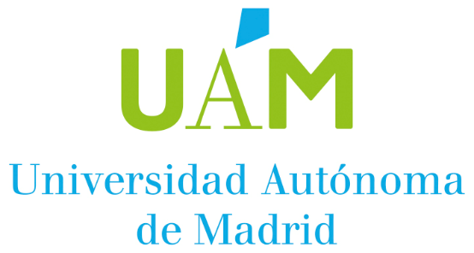
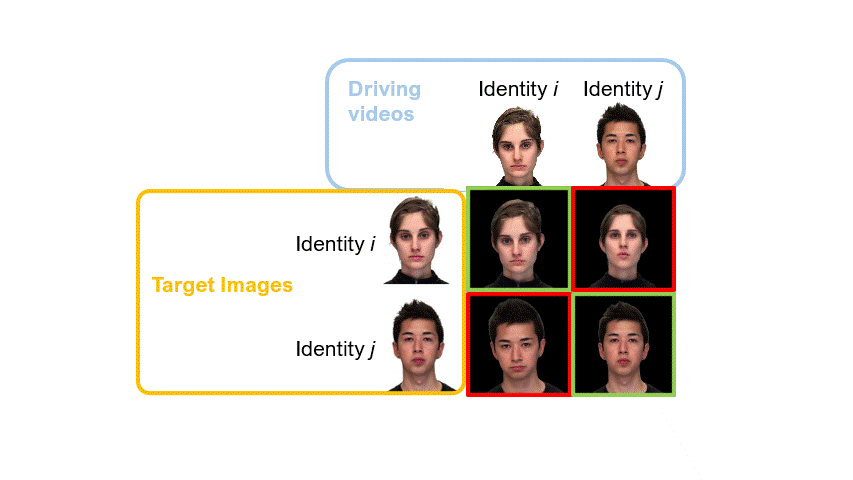

<h1 align="center">
  <a href="https://arxiv.org/abs/2508.00748">
    Is It Really You? Exploring Biometric Verification Scenarios in Photorealistic Talking-Head Avatar Videos
  </a>
</h1>


<h3 align="center">
    <a href='https://arxiv.org/abs/2508.00748'></a> &nbsp; 
    <a href='#request-for-access'></a> &nbsp; 
</h3>

<h5 align="center">
    <a href="https://scholar.google.com/citations?user=xYLElMkAAAAJ&hl=es">Laura Pedrouzo Rodriguez</a> &emsp;
    <a href="">Pedro Delgado-DeRobles</a> &emsp;
    <a href="https://scholar.google.com/citations?user=Nq3NyHYAAAAJ&hl=en">Luis F. Gomez</a> &emsp;
  <br>
    <a href="https://rubentolosana.github.io/">Ruben Tolosana Moranchel</a>  &emsp;
    <a href="https://scholar.google.com/citations?user=KYMQ0tsAAAAJ&hl=es">Ruben Vera Rodriguez</a>  &emsp;
    <a href="https://scholar.google.com/citations?user=yRP16B4AAAAJ&hl=es">Aythami Morales</a>  &emsp;
  <a href="https://scholar.google.com/citations?user=HbG_NOoAAAAJ&hl=en">Julian Fierrez</a>  &emsp;
    <br><br>
    Universidad Autónoma de Madrid, UAM
</h5>

<h3 align="center">
   &emsp;    &emsp;   
</h3>

# About

This is the official repository for the paper [Is It Really You? Exploring Viometric Verification Scenarios in Photorealistic Talking-Head Avatar Videos](https://arxiv.org/abs/2508.00748), accepted in [IEEE IJCB 2025](https://ijcb2025.ieee-biometrics.org/). 

We are releasing a **new talking-head avatar video dataset** and our **model implementation**, including our **pre-trained biometric verification models**.

# Avatar Dataset

We release a dataset of +150,000 videos of photorealistic avatars, generated using [GAGAvatar](https://github.com/xg-chu/GAGAvatar) (Neurips 2024). We take real videos from [RAVDESS](https://zenodo.org/records/1188976) and [CREMA-D](https://github.com/CheyneyComputerScience/CREMA-D) datasets as the base target identities and driving videos to generate our dataset. We include <span style="color: green">**genuine**</span> and <span style="color: red">**impostor**</span> videos. 
<div align="center">
  
</div>

### Data Structure

We provide the raw videos plus the preprocessed data (facial landmarks for each video, scaled, normalized, and split into time windows of 50 frames, same as in our paper). The files are organised in the following way:

```bash
GAGAvatar-Benchmark-db
├── preprocessed_data   # Here, only landmark data (numpy files)
│   ├── gagavatar_ravdess_and_cremad
│   │   ├── dev_landmarks_cut_50_50 # preprocess data for training and validation
│   │   │   ├── 1002                            # target identity
│   │   │   │   ├── 1002                        # driver identity
│   │   │   │   │   ├── 1002_DFA_ANG_XX_1002
│   │   │   │   │   │   └── w0.npy  # One numpy file for each 50 frames in the video
│   │   │   │   │   ├── 1002_DFA_DIS_XX_1002
│   │   │   │   │   │   └── w0.npy
│   │   │   │   │   ├── 1002_MTI_DIS_XX_1002
│   │   │   │   │   │   ├── w0.npy
│   │   │   │   │   │   └── w1.npy  # Two numpy files because this video had more than 2*50 frames
│   │   │   │   │   └── ...
│   │   │   │   ├── Actor_01
│   │   │   │   │   ├── 1002_DFA_HAP_XX_Actor_01
│   │   │   │   │   │   └── w0.npy
│   │   │   │   │   └── ...
│   │   │   │   └── ...
│   │   │   └── ...
│   │   └── test_landmarks_cut_50_50
│   ├── originals_cremad
│   │   └── test_landmarks_cut_50_50
│   └── originals_ravdess
│       └── test_landmarks_cut_50_50
└── raw_videos  # Here, the mp4 avatar videos
    ├── dev
    │   └── GAGAvatar
    │       ├── 01-01-01-01-01-01-01_1002.mp4
    │       ├── 01-01-01-01-01-01-01_1004.mp4
    │       ├── 01-01-01-01-01-01-01_1006.mp4
    │       ├── ...
    │       ├── 1089_WSI_SAD_XX_Actor_13.mp4
    │       ├── 1089_WSI_SAD_XX_Actor_15.mp4
    │       └── 1089_WSI_SAD_XX_Actor_16.mp4
    └── test
        └── GAGAvatar
            ├── 01-01-01-01-01-01-19_1038.mp4
            ├── 01-01-01-01-01-01-19_1041.mp4
            ├── 01-01-01-01-01-01-19_1059.mp4
            ├── ...
            ├── 1091_WSI_SAD_XX_Actor_22.mp4
            ├── 1091_WSI_SAD_XX_Actor_23.mp4
            └── 1091_WSI_SAD_XX_Actor_24.mp4
```

### Raw data

In the `raw_videos` folder, you can find two subfolders: `dev` and `test`. 

The dev folder contains all the videos used for development (training and validation), and the test folder contains all the videos used for evaluation. The data was split so that each identity can only be present as driver or target in one of the subsets, either in dev or in test, i.e. test data contains ONLY unseen target and driver identities .

The naming convention used for the video files is:

    <driver_video_filename>_<target_identity>.mp4

The video filename was taken from the real databases [RAVDESS](https://zenodo.org/records/1188976) and [CREMA-D](https://github.com/CheyneyComputerScience/CREMA-D)  (see their documentation for information on their naming convention). The target identity corresponds to:
- *"Actor_XX"* : for identities from [RAVDESS](https://zenodo.org/records/1188976) dataset, being *XX* the actor ID according to their documentation
- *"XXXX"* : for identities from [CREMA-D](https://github.com/CheyneyComputerScience/CREMA-D) dataset, being *XXXX* the actor ID according to their documentation


> **Example**
> 
> Avatar video with filename `01-01-01-01-01-01-01_1006.mp4`, would correspond to an avatar generated with the driver video `01-01-01-01-01-01-01.mp4` (from RAVDESS database, corresponds to Actor_01), using identity `1006` from CREMA-D as the target (appearance).

### Preprocessed data

We provide the preprocessed landmark files for the avatar videos we generated (`gagavatar_ravdess_and_cremad`), plus for the original RAVDESS (`originals_ravdess`) and CREMA-D (`originals_cremad`) videos to replicate our experiments.

We split the data into `dev` and `test` in the same fashion as in the raw data. We organise the numpy files into directories by driver, target, and avatar video filename, as shown in [Data Structure](#data-structure).

For each video, we provide one or more `*.npy` files containing the preprocessed landmarks in chunks of 50 frames. Videos shorter than 50 frames are not included in the preprocessed data. The files are named `w0.npy`, `w1.npy`, `w2.npy`, etc., where each file corresponds to the next 50-frame segment of the video.

> ⚠️ **Note**
>
> The preprocessed data is missing some videos because of errors with the facial landmarker. The total number of preprocessed videos provided is around **135k**.


# Biometric Verification System

Our biometric verification system consists of:

- A preprocessing stage: we obtain facial landmarks from a video and connect them to build a graph for each frame in the video
- A Graph Convolutional Network (GCN): which generates a single embedding per frame (i.e., per graph)
- A Temporal Attention Pooling block: which aggregates all the frame embeddings into a single embedding representing the whole video


For more details, please check the paper [here](https://arxiv.org/abs/2508.00748).

We provide the code we use to train and evaluate this system, plus 3 pre-trained checkpoints:
- pre-trained model using only RAVDESS identities
- pre-trained model using only CREMA-D identities
- pre-trained model using RAVDESS + CREMA-D identities

## Training


## Evaluation


# Requesting access

If you want to gain access to the dataset, code and the pre-trained models, follow these steps:

1. Download [this](assets/GAGAvatar-Benchmark-db_Agreement.pdf) license agreement, complete it and sign it
2. Send an email to **[atvs@uam.es](mailto:atvs@uam.es)** with the following information:

   - ***Subject***: `[DATABASE: GAGAvatar-Benchmark-db]`
   
   - ***Body***:  Include your full name, email, phone number, organization, postal address and the purpose for which you will use the database
   
   - ***Attachments***: The signed and scanned license agreement (PDF)
   
3. Once we receive the license agreement and review your request, you will receive an email with a username, password and instructions to download the data.
4. For more information or if you encounter any truoble, please contact atvs@uam.es


# Contact

For more information contact Rubén Tolosana, associate professor at UAM at **[ruben.tolosana@uam.es](mailto:ruben.tolosana@uam.es)**

